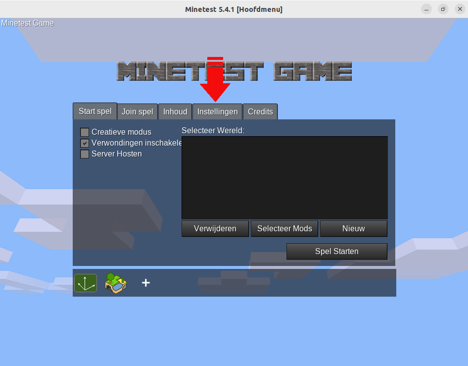
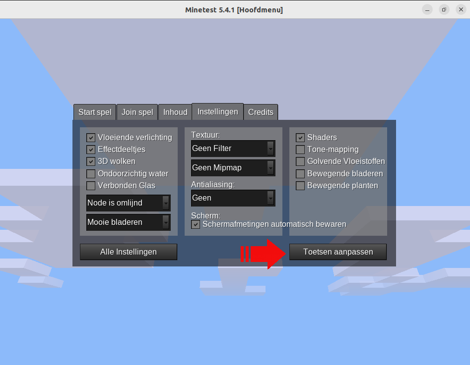
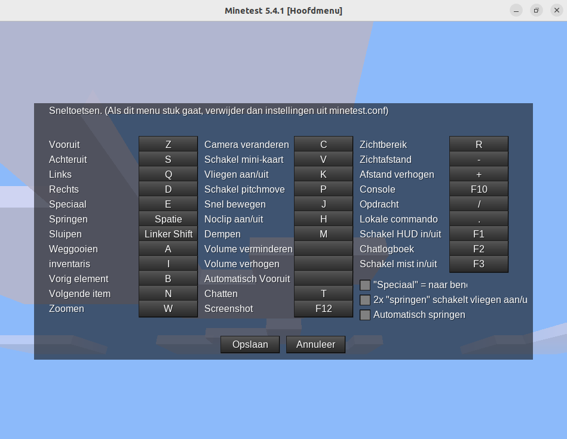
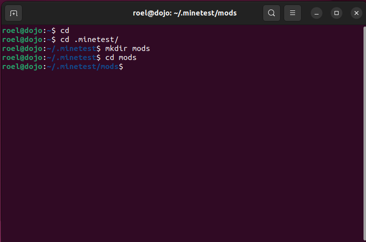
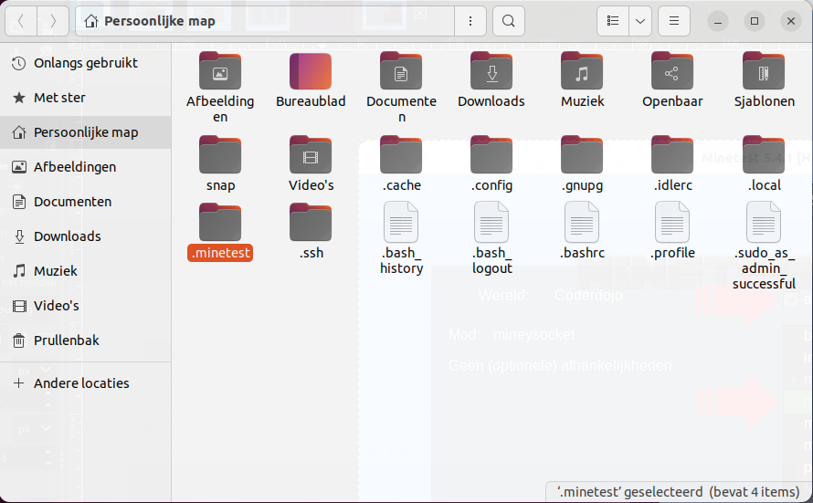
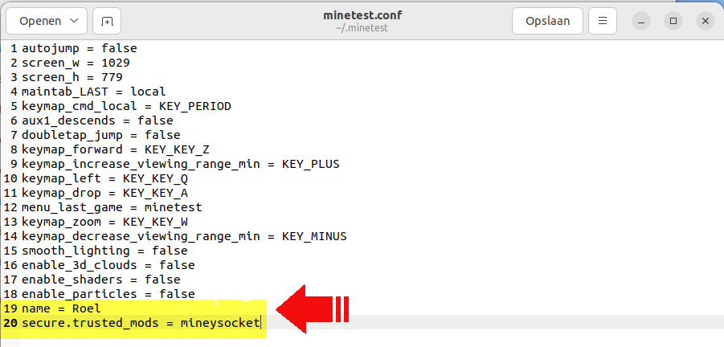
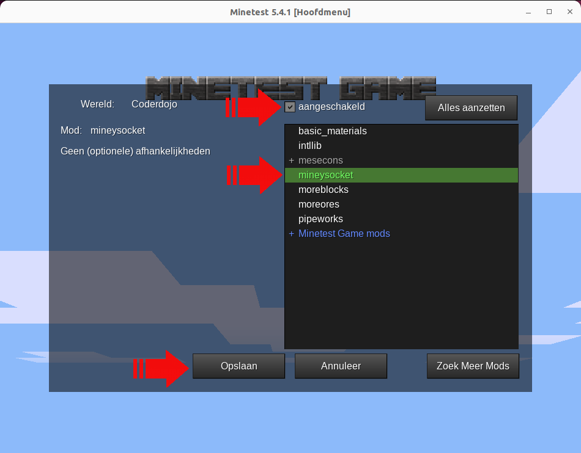
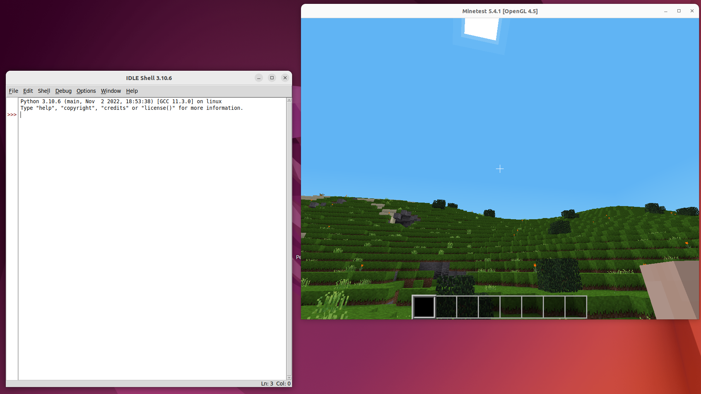
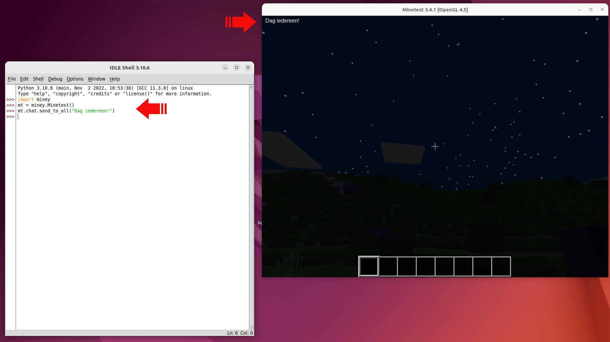

# Installatie op Ubuntu

Ik ga hier even door de installatie op Ubuntu 22.04 LTS omdat deze de recentste LTS release is en dus lang ondersteuning heeft. Als je een andere Linux distributie gebruikt zijn de stappen gelijkaardig maar moet je de commandos aanpassen als je geen `apt` gebruikt om packages te installeren.

De installatieprocedure is ook beschikbaar op de pagina [quickstart](https://miney.readthedocs.io/en/latest/quickstart.html#linux) van de Miney documentatie.

We installeren eerst wat packages die we nodig hebben, zoals `python`, `pip` en `git`. Ook `python-is-python3` zodat we niet steeds `python3` moeten typen maar gewoon `python`.

```shell
sudo apt install python3 python3-pip python-is-python3 git idle3 luajit lua-socket lua-cjson
```

Nu `minetest`, wat lettertypes, minetestmods en tools.

```shell
$ sudo apt install minetest fonts-crosextra-caladea fonts-crosextra-carlito minetest-mod-moreblocks minetest-mod-moreores minetest-mod-pipeworks minetest-server minetestmapper
```

Nu is Minetest geïnstalleerd, start het spel eens op. Dit doen we om twee redenen, ten eerste kunnen we de toetsen juist configureren, die staan standaard voor een querty-toetsenbord ingestelt, en ten tweede wordt er een verborgen `.minetest` folder gemaakt in ons homefolder met daarin de configuratie. In die verborgen folder moeten we straks een mod installeren.

Minetest starten kan vanuit het startmenu. Ga in het spel naar het tabblad *Instellingen* en klik *Toetsen aanpassen*.





Ik stel voor van minstens dit aan te passen:

  - Vooruit: Z
  - Links: Q
  - Weggooien: A
  - Zoomen: W



Klik op opslaan en gebruik dan de escape-toets om het spel af te sluiten.

Laten we snel even de `miney`-bibliotheek installeren:

```shell
pip install miney
```

Als je Minetest een keer hebt gestart is er de verborgen folder `.minetest`. Vanuit de terminal ga je eerst naar je home folder (daar ben je standaard al als je een nieuwe terminal start) door een keer `cd` uit te voeren. Ga in de de `.minetest` folder met `cd ./minetest` en maak de `mods` folder met `mkdir mods`. Ga dan in die folder.



In die folder gaan we nu de `mineysocket` mod installeren rechtstreeks van de [Mineysocket GitHub-repository](https://github.com/miney-py/mineysocket). Hiervoor gebruiken we de tool *Git*, we gaan het project *clonen* in deze folder:

```shell
git clone https://github.com/miney-py/mineysocket.git
```

We moeten de Mineysocket mod nog toevoegen aan de `trusted_mods`-setting in de config-file. In de bestandsbeheerder in je home folder moet je verborgen bestanden aanzetten (of gebruik *ctrl+h*), dan zie je de `.minetest` folder verschijnen:



In die map zit het bestandje `minetest.conf`, open dit met de teksteditor en voeg een paar regels toe:

 - `name = JOUWNAAM`
 - `secure.trusted_mods = mineysocket`




Start Minetest opnieuw, maak een nieuwe wereld aan en bij *Selecteer Mods* zorg er voor dat zeker **mineysocket** aangeschakeld is. Klik dan op *Opslaan*.



Klik op *Spel Starten*. Je kan een beetje rondhuppelen en wat idioot doen en als je daarmee klaar bent gebruik je *alt-tab* om de focus uit het spel te brengen. Nu kan je een Python editor of IDE starten.

We heben IDLE geïnstalleerd maar niets houdt je tegen om bijvoorbeeld Visual Studio Code of iets anders te gebruiken.

Start IDLE, als alles goed is heb je nu een IDLE venster en een Minetest venster:



We gaan nu iets supereenvoudig uitvoeren om te testen of Python met Minetest kan praten. Als dit lukt zijn we helemaal klaar om de uitdagingen van de Coderdojo aan te vallen.

In Python werkt het meestal zo:

 - we importeren de libraries die we nodig hebben, in dit geval `miney`
 - we maken objecten aan die we gaan gebruiken om dingen te doen
 - we schrijven code om instructies te geven aan die objecten

Dus we importeren de library `miney`:

```python
import miney
```

We maken een object dat we `mt` noemen, als afkorting voor MineTest. Dit object is een `Minetest`-object dat beschreven is in de `miney` library dus we moeten dit zo schrijven:

```python
mt = miney.Minetest()
```

Nu we een Minetest object hebben kunnen we dat gebruiken, bijvoorbeeld om een chatbericht te sturen naar iedereen op de server:

```python
mt.chat.send_to_all("Dag iedereen!")
```

De hele blok testcode ziet er zo uit:

```python
import miney

mt = miney.Minetest()

mt.chat.send_to_all("Dag iedereen!")
```

Bij het uitvoeren van die laatste regel zien we in het spel het chatbericht verschijnen.



Als dat werkte is alles goed ingesteld om te beginnen spelen met Python